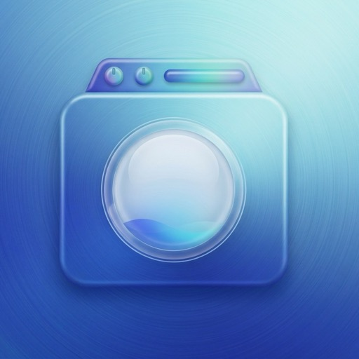
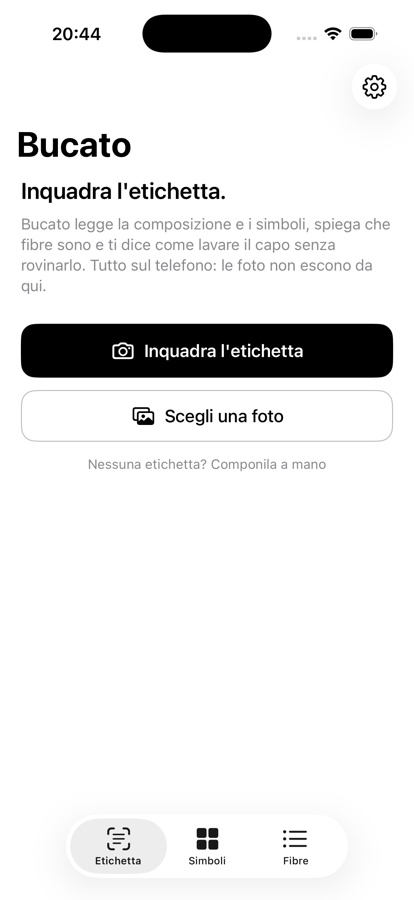
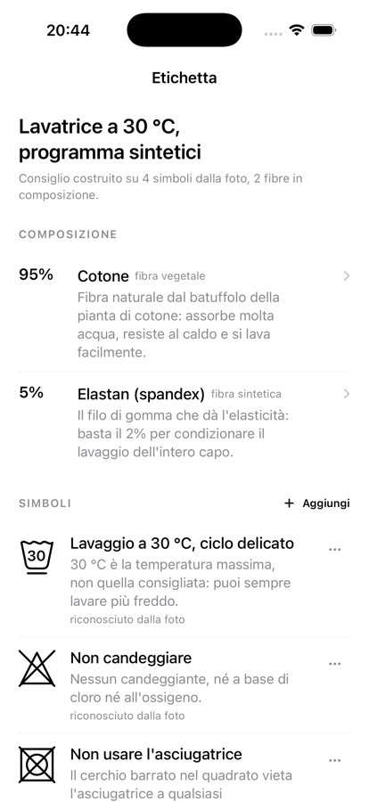

<div align="center">
  
  <h1>Bucato</h1>
  <p><strong>Inquadri l'etichetta, e sai come lavare il capo.</strong></p>
  <p>Nessun account · Nessun abbonamento · Nessuna rete · Nessun tracciamento</p>
</div>

---

Bucato è un'app per iPhone e iPad che legge l'etichetta di un capo: riconosce i
**simboli di lavaggio** dalla foto, legge la **composizione** in percentuali,
spiega in una riga che fibre sono e mette insieme le due cose in un consiglio
concreto — temperatura, programma, centrifuga, detersivo, asciugatura, ferro.

L'app è ispirata a [Laundry Lens](https://apps.apple.com/it/app/laundry-lens/id1513767864),
di cui riprende l'idea di fondo, con qualche differenza:

| Laundry Lens | Bucato |
| --- | --- |
| Riconosce i simboli | Riconosce i simboli **e** legge la composizione, e incrocia le due letture |
| Spiega il simbolo | Spiega il simbolo, spiega la fibra e dice **cosa fare in lavatrice** |
| App a pagamento sull'App Store | Gratis, codice aperto, si installa con AltStore |

Bucato è un progetto indipendente, non affiliato con Laundry Lens né con i suoi autori.

<div align="center">
  
  
</div>

## Cosa fa

- **Inquadri e basta** — lo scanner di sistema ritaglia e raddrizza l'etichetta, poi l'app cerca i simboli nella foto: bacinella, triangolo, quadrato, ferro e cerchio, con i loro pallini, trattini, linee e divieti. Sono 43 simboli, tutta la norma ISO 3758.
- **Composizione** — legge le percentuali anche quando l'etichetta le ripete in quattro lingue, tiene separati esterno, fodera e imbottitura, e riconosce una trentina di fibre con i loro nomi in italiano, inglese, francese, tedesco, spagnolo e portoghese. Ogni fibra è spiegata in una riga: cos'è, e cosa le fa male.
- **Il consiglio** — un motore di regole incrocia i simboli con le fibre e produce il programma: massimo di temperatura, ciclo, giri di centrifuga, tipo di detersivo, asciugatura, ferro, lavanderia. Quando l'etichetta è più permissiva di quanto la fibra sopporti, l'app lo dice invece di scegliere di nascosto.
- **Correggi tu** — ogni simbolo riconosciuto si può sostituire o togliere, e quelli incerti sono marcati «da confermare». Se l'etichetta è illeggibile o non c'è più, la composizione si scrive a mano.
- **Armadio** — i capi che rilavi spesso si salvano con foto e nome, e il consiglio viene ricalcolato ogni volta: se migliorano le regole, migliorano anche le schede vecchie.
- **Dizionario** — tutti i simboli e tutte le fibre, sfogliabili e cercabili, anche senza scansionare niente.

## Aspetto

Bucato è **in bianco e nero**: sfondo di sistema, inchiostro nero, righe sottili,
nessun colore d'accento e nessuna scheda colorata. In modo scuro si inverte tutto.
L'unica forma con un carattere proprio è il simbolo di lavaggio, disegnato come
linea, mai come immagine importata.

## Come legge i simboli

Non c'è nessun modello addestrato e nessun file di rete neurale: i simboli di
lavaggio sono un alfabeto piccolo e rigido, quindi l'app li **misura**.

1. **Binarizzazione adattiva** — la foto passa in scala di grigi e ogni pixel viene
   confrontato con la media del suo intorno (metodo di Bradley), non con una soglia
   globale: è questo che permette di leggere un'etichetta sgualcita con un'ombra di
   traverso. Se l'etichetta è nera con stampa bianca, l'immagine viene invertita.
2. **Raddrizzamento** — nessuno tiene il telefono dritto sopra una cucitura. L'app
   prova le inclinazioni fra −16° e +16° e tiene quella che allinea l'inchiostro
   nelle righe più compatte, poi ruota la foto. Senza questo passaggio bastano 6°
   per far sbagliare tutto.
3. **Componenti connesse** — le macchie di inchiostro vengono etichettate con
   union-find a 8 vicini e filtrate per dimensione, proporzioni e «vuotezza»: un
   simbolo è un contorno, non un blocco pieno.
4. **Righe** — una `O` è un cerchio e una `D` gli somiglia parecchio, quindi le
   lettere della composizione stampata verrebbero lette come simboli. A tradirle è
   la compagnia: le macchie vengono raggruppate nella riga su cui stanno, e una riga
   si tiene solo se la maggior parte di ciò che c'è sopra si è rivelato un simbolo.
   In una riga di simboli combacia quasi tutto, in `COTONE` quasi niente.
5. **Sagoma** — il contorno viene dilatato di un pixel per chiudere le
   interruzioni della stampa, poi si allaga l'esterno: quello che l'acqua non
   raggiunge è l'interno del simbolo.
6. **Misura** — la sagoma diventa sedici numeri (quanto inchiostro c'è in ognuna di
   sedici fasce orizzontali), più sedici scostamenti laterali e il rapporto di
   riempimento. È il descrittore che distingue una bacinella da un triangolo e —
   grazie agli scostamenti — un ferro da tutto ciò che è simmetrico.
7. **Confronto** — il descrittore viene confrontato con quelli dei cinque contorni
   di riferimento, che l'app **si disegna da sola all'avvio** e misura con lo stesso
   identico codice. I simboli barrati hanno il loro set di riferimenti, perché una
   croce cambia troppo la sagoma per far finta di niente.
8. **Segni interni** — pallini, trattini sotto, linee verticali e orizzontali,
   cerchio dell'asciugatrice, mano, tratto d'ombra, vapore barrato: ognuno ha una
   regola geometrica. Il numero dentro la bacinella e la lettera dentro il cerchio
   li legge Vision, su un ritaglio ingrandito e con l'alfabeto ristretto a
   `30 40 50 60 70 95 P F W`.
9. **Lettura** — la combinazione (contorno + segni) viene cercata nel catalogo. Se
   non c'è una corrispondenza esatta si prende la più vicina, e la confidenza cala:
   sotto una certa soglia il simbolo viene mostrato come «da confermare».

Quando la temperatura dentro la bacinella non si legge, l'app **non la inventa**:
mostra `Lavabile in acqua` e lascia decidere alla composizione.

## Come legge la composizione

Il testo lo riconosce Vision, in sette lingue e senza correzione automatica — su
un'etichetta la correzione inventa parole più di quante ne aggiusti. Poi:

- ogni percentuale viene agganciata al nome di fibra che le sta più vicino, prima a
  destra (`80% cotone`) e poi a sinistra (`cotone 80%`);
- il nome viene normalizzato (via accenti, via maiuscole) e cercato fra circa
  duecento sinonimi; se non combacia si accetta un errore di una o due lettere, così
  `polvestere` finisce comunque su poliestere;
- le percentuali vengono raggruppate: quando la somma arriva a 100 o una fibra si
  ripete, il gruppo si chiude. È così che `95% cotone 5% elastan` ripetuto in
  tedesco e in francese viene contato una volta sola, mentre `esterno` e `fodera`
  restano due sezioni distinte;
- le istruzioni scritte a parole (`lavare a mano`, `non candeggiare`, `do not tumble
  dry`) diventano simboli a tutti gli effetti, e in caso di disaccordo con la foto
  vincono loro: le parole sono più affidabili di un disegno di sei millimetri.

## Come decide il consiglio

Il motore tiene separate due fonti. **L'etichetta comanda** nella sua famiglia: se
c'è scritto 40 °C, il consiglio dice 40 °C. **Le fibre** riempiono i vuoti e, quando
sono più severe, aggiungono un avviso invece di sovrascrivere in silenzio — «l'etichetta
arriva a 60 °C, ma con il 60% di viscosa conviene fermarsi a 30 °C».

Fa eccezione la temperatura che un simbolo *implica* invece di stamparla: la manina
vale «fino a 40 °C» per norma, non perché lo dica quell'etichetta, e quindi cede
davanti ai 30 °C della lana.

Il resto si compone così: la centrifuga è la più bassa fra quelle ammesse, il
detersivo il più delicato fra quelli necessari, l'asciugatura e il ferro seguono il
simbolo se c'è. In fondo ci sono gli avvisi specifici — il 2% di elastan che decide
il lavaggio dell'intero capo, le palline da tennis per il piumino, la lana che
appesa si allunga.

## Apple Intelligence

Su iPhone che hanno Apple Intelligence, in fondo alla scheda compare un riassunto
di due righe scritto dal modello di sistema **sul dispositivo**, con
`FoundationModels`. Il modello riceve solo la lettura dell'etichetta e il programma
già deciso, con l'istruzione esplicita di non cambiare temperature, programmi o
divieti: riformula, non decide.

Il framework è collegato in modo debole (`-weak_framework`), quindi l'app parte
identica da iOS 17 in su; dove il modello non c'è, al suo posto compare il riassunto
scritto dalle regole. Si può spegnere in Impostazioni.

## Privacy

Tutto succede sul dispositivo: riconoscimento del testo, riconoscimento dei simboli,
consiglio e — dove c'è — riassunto. L'app non ha codice di rete, non ha account, non
raccoglie niente. Le foto non vengono salvate, tranne la miniatura di un capo che
scegli di mettere nell'armadio.

## Installazione

### Con AltStore (consigliato)

1. Installa [AltStore](https://altstore.io) e [SideStore](https://sidestore.io) o [AltStore PAL](https://altstore.io/pal), secondo la tua configurazione.
2. In AltStore apri **Sources → + (Aggiungi sorgente)** e incolla:

   ```
   https://raw.githubusercontent.com/filippobenozzi/laundry-app/main/altstore/source.json
   ```

3. Apri la sorgente **Bucato** e installa l'app.

Gli aggiornamenti arrivano da soli: ogni release aggiorna il file `source.json` di
questo repository, che AltStore rilegge.

### Con l'IPA

Ogni [release](https://github.com/filippobenozzi/laundry-app/releases) allega
`Bucato.ipa`, non firmata: installabile con AltStore, SideStore o Sideloadly.

> Con un Apple ID gratuito la firma dura sette giorni e vale per tre app alla volta;
> AltStore la rinnova da solo finché il computer o il dispositivo di supporto è
> raggiungibile.

## Compilare

Il progetto Xcode non è versionato: lo genera [XcodeGen](https://github.com/yonaskolb/XcodeGen) da `project.yml`.

```bash
./Tools/bootstrap.sh   # installa XcodeGen se manca, poi genera Bucato.xcodeproj
open Bucato.xcodeproj
```

Serve Xcode 26 o successivo (per il macro `@Generable` di FoundationModels);
l'app gira da iOS 17.0.

## Verifiche

```bash
./Tools/run-checks.sh
```

Compila la logica pura e la esegue sul Mac, senza simulatore. Controlla il
riconoscimento delle fibre, il parser della composizione su etichette vere, il
motore del consiglio e — soprattutto — il riconoscimento dei simboli: ogni simbolo
del catalogo viene **disegnato, fotografato e riletto**, insieme a righe intere di
simboli, con grana, a bassa risoluzione e inclinate di ±12°. Le stesse verifiche
girano in CI a ogni push.

## Rilasciare

Da GitHub → **Actions → Build → Run workflow**, indicando la versione (es. `1.0.1`)
e due righe di note. Il workflow compila, esegue le verifiche, crea la release con
l'IPA e aggiorna `altstore/source.json`. In alternativa basta un tag:

```bash
git tag v1.0.1 && git push origin v1.0.1
```

## Struttura

```
Bucato/
  App/           punto d'ingresso e struttura a schede
  Model/         fibre, simboli, parser della composizione, motore del consiglio
  Scan/          binarizzazione, raddrizzamento, componenti, riconoscimento simboli, Vision
  Intelligence/  riassunto con FoundationModels, opzionale
  Features/      le schermate
  Support/       geometria dei simboli, tema, disegno
Tests/           le verifiche eseguite da Tools/run-checks.sh
Tools/           bootstrap, pacchettizzazione IPA, aggiornamento sorgente AltStore
altstore/        la sorgente che AltStore legge
```

## Limiti, detti chiaramente

- Il riconoscimento dei simboli funziona su etichette **stampate e a fuoco**. Su
  etichette tessute, sbiadite o fotografate da lontano sbaglia: per questo ogni
  simbolo si può correggere a mano, e quelli dubbi sono marcati.
- L'inclinazione viene corretta fino a circa ±16°; la prospettiva forte no. Lo
  scanner di sistema aiuta parecchio: usalo invece della galleria quando puoi.
- Il consiglio è un'indicazione ragionata, non una garanzia. Su un capo a cui tieni,
  in caso di dubbio vince sempre il trattamento più delicato.

## Licenza

MIT — vedi [LICENSE](LICENSE).
